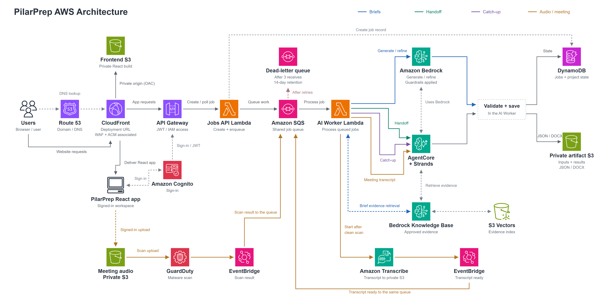

# PilarPrep

[](https://github.com/aadams35/pilarprep-aws/actions/workflows/ci.yml)

**Customer context into meeting preparation, shared handoffs, and accountable follow-up.**

PilarPrep helps Sales and Solutions Architects prepare from the same customer facts. It generates audience-specific briefs, supports targeted refinement, and compares meeting transcripts with the approved plan before a person accepts any changes.

Built for an AWS-focused hackathon, where our team won, and continued as a working serverless application.

[Try the demo](https://pilarprep.app) | [Architecture and code map](docs/architecture/code-map.md) | [Deploy to AWS](DEPLOYMENT.md) | [Security](SECURITY.md)

> The public demo uses fictional customer scenarios. Do not enter confidential customer information or upload real customer recordings. Audio processing requires sign-in and is currently limited to the synthetic BlueMesa scenario.

## The Workflow

1. **Prepare:** enter customer objectives, constraints, company values, decision-makers, stakeholders, and ranked AWS priorities.
2. **Refine:** review business, technical, executive, stakeholder, game-plan, and objection briefs. Feedback regenerates the selected tab while preserving the others.
3. **Align:** approve the current packet and explicitly prepare a pre-call team handoff.
4. **Meet:** upload the synthetic recording. Malware scanning precedes transcription and comparison with the approved brief.
5. **Follow up:** review proposed changes, capture decisions and owners, and prepare the next handoff. Catch-up views help teammates join with the latest approved context.

## Architecture



The React app runs in the browser. CloudFront serves it from private S3 and proxies workspace API requests. The diagram shows the signed-in workspace separately to make its direct upload to private meeting-audio S3 explicit. The shared job pipeline is **API Gateway -> Jobs API Lambda -> SQS -> AI Worker Lambda**. Briefs use Amazon Bedrock. Handoff, catch-up, and meeting analysis use AgentCore, with Strands coordinating the agent workflows. Scoped retrieval uses Bedrock Knowledge Bases and S3 Vectors. DynamoDB tracks application state; private S3 stores inputs, evidence, and generated documents.

The two audio events return to the same queue: first the malware-scan result, then the transcription result. "Validate + save" is code inside the AI Worker, not an extra deployed Lambda.

The diagram also shows Route 53 DNS and the SQS dead-letter queue. AWS WAF and ACM remain separate services associated with CloudFront; their icons are collapsed into its annotation for readability. The blue dashed evidence connection belongs to brief generation and refinement in the AI Worker; AgentCore's shared evidence connection stays neutral. Shared monitoring, alerting, encryption, and secret-management services remain configured but are omitted from this view. Route 53 resolves `pilarprep.app` to CloudFront; its dashed DNS connection is separate from the solid application request path. The service-flow view uses official AWS icons and does not imply a VPC or private-subnet deployment. AgentCore internals remain collapsed so tools and memory do not distract from the main routes. Meeting interpretation and packet corrections use Bedrock through Strands; customer context is not PII-screened or redacted by Comprehend.

See [Architecture](ARCHITECTURE.md) for the request flows and current tradeoffs. The [code map](docs/architecture/code-map.md) connects every diagram box to its implementation or infrastructure definition.

## Engineering Highlights

- Durable asynchronous jobs, bounded worker concurrency, retries, and a dead-letter queue.
- Scope-checked access, private S3 origins, encrypted data, and authenticated audio uploads.
- Target-isolated refinement, contradiction checks, version-aware approval, and explicit human review.
- Evidence references and source coverage, with uncertainty surfaced rather than hidden.
- Role-aware handoffs, approved-evidence retrieval, and downloadable JSON/DOCX packets.
- Unit, contract, infrastructure, browser, and offline scenario tests in CI.

## Repository Layout

```text
frontend/src/              React application and browser API clients
backend/jobs_api/          Jobs API Lambda entry point
backend/ai_worker/         Shared SQS worker entry point
backend/bedrock/           Brief generation, refinement, and validation
backend/agentcore/         Runtime, Strands workflows, memory, and governed tools
backend/pipeline/          Job state, audio/transcription, evidence, and promotion
backend/shared/            Shared content-safety controls
infrastructure/            CloudFormation/SAM templates, named by service group
data/                     Fictional scenarios, evidence corpus, and evaluation rubric
demo-assets/               Synthetic BlueMesa meeting audio
tests/                    Frontend unit and browser tests
evals/                    Offline checks and opt-in model comparison scenarios
scripts/                  Deployment, publication checks, and optional live smoke tests
docs/                     Architecture, operations, and engineering decisions
```

## Run Locally

Requires Node.js 22.13+ and npm. Python 3.12 is the deployed backend runtime.

```powershell
git clone https://github.com/aadams35/pilarprep-aws.git
cd pilarprep-aws
npm ci
npm run dev
```

Open the local URL printed by Vite. Without AWS configuration, the app uses explicitly labeled deterministic demo output. It does not require AWS credentials to explore the local UI. Live AWS failures do not silently fall back to that demo output.

Configure public browser identifiers using [.env.example](.env.example) when connecting to your own deployment. Never put AWS access keys or other secrets in browser environment variables.

## Verify

```powershell
python -m pip install -r requirements-dev.txt
npx playwright install chromium
npm run verify
```

The default verification suite uses local fixtures and mocked AWS services; it does not deploy infrastructure or invoke paid models. Live smoke-test scripts are separate and require explicit configuration. Offline rubric scores are regression checks, not measurements of live model accuracy.

## Compare Models

The [model evaluation guide](evals/README.md) includes 28 synthetic scenarios for generation, all six refinement tabs, handoff, catch-up and BlueMesa meeting analysis. Compare Nova Pro with another Bedrock model using production prompts, deterministic checks, a fixed Strands Evals judge and a human-review worksheet. A preview is free; paid inference requires an explicit `-Live` flag. The suite does not change the deployed app or customer state.

## Further Reading

- [Deployment](DEPLOYMENT.md): prerequisites, stack order, configuration, and validation.
- [Resource names](docs/resource-names.md): physical storage names, migration safeguards, and rollback retention.
- [Security](SECURITY.md): demo boundaries, reporting, and known production gaps.
- [Operations](docs/operations.md): failed jobs, DLQ handling, audio events, and cost controls.
- [Engineering decisions](docs/engineering-decisions.md): tradeoffs and remaining work.
- [Contributing](CONTRIBUTING.md) and [attribution](NOTICE.md).
