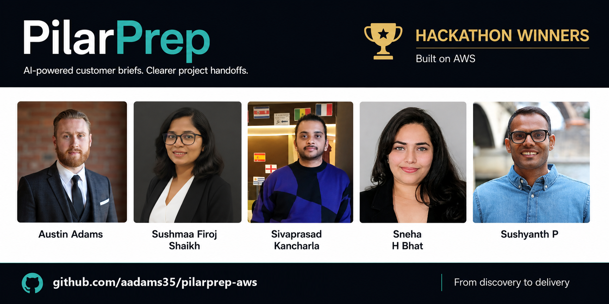

# PilarPrep

[](https://github.com/aadams35/pilarprep-aws/actions/workflows/ci.yml)

**Customer context into meeting preparation, shared handoffs, and accountable follow-up.**

PilarPrep helps Sales and Solutions Architects prepare from the same customer facts. It generates audience-specific briefs, supports targeted refinement, and compares meeting transcripts with the approved plan before a person accepts any changes.

Built for an AWS-focused hackathon, where our team won, and continued as a working serverless application.

[Try the demo](https://pilarprep.app) | [Architecture and code map](docs/architecture/code-map.md) | [Deploy to AWS](DEPLOYMENT.md) | [Security](SECURITY.md)

> The public demo uses fictional customer scenarios. Do not enter confidential customer information or upload real customer recordings. Audio processing requires sign-in and is currently limited to the synthetic BlueMesa scenario.

> **Returning to an existing client?** Open **Catch-up** in the top navigation to see the latest packet for each client and generate a role-aware summary without changing approved project state.

## The Workflow

1. **Prepare:** enter customer objectives, constraints, company values, decision-makers, stakeholders, and ranked AWS priorities.
2. **Refine:** review business, technical, executive, stakeholder, game-plan, and objection briefs. Feedback regenerates the selected tab while preserving the others.
3. **Align:** approve the current packet and explicitly prepare a pre-call team handoff.
4. **Meet:** upload the synthetic recording. Malware scanning precedes transcription and comparison with the approved brief.
5. **Follow up:** review proposed changes, capture decisions and owners, and prepare the next handoff. Catch-up views help teammates join with the latest approved context.

## Architecture


**How to read it:** follow the main request path from left to right. Route 53 and CloudFront deliver the React app. Every AI action enters the same API, SQS queue, and worker before branching by action:

- **Briefs:** Bedrock generates or refines the packet.
- **Handoff and catch-up:** AgentCore and Strands use approved client context. Catch-up is read-only.
- **Meeting audio:** signed-in uploads are malware-scanned and transcribed; each service event returns to the shared queue.
- **Evidence and results:** client-scoped evidence comes from the Knowledge Base, while DynamoDB and private S3 hold application state and artifacts.

The API returns a job ID immediately while processing continues in the background. The app polls for status instead of holding one long request open. "Validate + save" is the final step inside the AI Worker, not another Lambda.

For readability, WAF, ACM, monitoring, encryption, and secret management are summarized rather than drawn as separate branches. The diagram uses official AWS icons and does not imply a VPC or private-subnet deployment.

See [Architecture](ARCHITECTURE.md) for the request flows and current tradeoffs. The [code map](docs/architecture/code-map.md) connects every diagram box to its implementation or infrastructure definition.

## Engineering Highlights

- Durable asynchronous jobs, bounded worker concurrency, retries, and a dead-letter queue.
- Scope-checked access, private S3 origins, encrypted data, and authenticated audio uploads.
- Target-isolated refinement, contradiction checks, version-aware approval, and explicit human review.
- Evidence references and source coverage, with uncertainty surfaced rather than hidden.
- Role-aware handoffs, approved-evidence retrieval, and downloadable JSON/DOCX packets.
- Unit, contract, infrastructure, browser, and offline scenario tests in CI.

## Repository Layout

```text
frontend/src/              React application and browser API clients
backend/jobs_api/          Jobs API Lambda entry point
backend/ai_worker/         Shared SQS worker entry point
backend/bedrock/           Brief generation, refinement, and validation
backend/agentcore/         Runtime, Strands workflows, memory, and governed tools
backend/pipeline/          Job state, audio/transcription, evidence, and promotion
backend/shared/            Shared content-safety controls
infrastructure/            CloudFormation/SAM templates, named by service group
data/                     Fictional scenarios, evidence corpus, and evaluation rubric
demo-assets/               Synthetic BlueMesa meeting audio
tests/                    Frontend unit and browser tests
evals/                    Offline quality and regression scenarios
scripts/                  Deployment, publication checks, and optional live smoke tests
docs/                     Architecture, operations, scaling, and supporting guides
```

## Run Locally

Requires Node.js 22.13+ and npm. Python 3.12 is the deployed backend runtime.

```powershell
git clone https://github.com/aadams35/pilarprep-aws.git
cd pilarprep-aws
npm ci
npm run dev
```

Open the local URL printed by Vite. Without AWS configuration, the app uses explicitly labeled deterministic demo output. It does not require AWS credentials to explore the local UI. Live AWS failures do not silently fall back to that demo output.

Configure public browser identifiers using [.env.example](.env.example) when connecting to your own deployment. Never put AWS access keys or other secrets in browser environment variables.

## Verify

```powershell
python -m pip install -r requirements-dev.txt
npx playwright install chromium
npm run verify
```

The default verification suite uses local fixtures and mocked AWS services; it does not deploy infrastructure or invoke paid models. Live smoke-test scripts are separate and require explicit configuration. Offline rubric scores are regression checks, not measurements of live model accuracy.

## Further Reading

- [Deployment](DEPLOYMENT.md): prerequisites, stack order, configuration, and validation.
- [Security](SECURITY.md): demo boundaries, reporting, and known production gaps.
- [Operations](docs/operations.md): failed jobs, DLQ handling, audio events, and cost controls.
- [Scaling](docs/scaling.md): simultaneous users, worker limits, load checks, and a phased capacity plan.
- [Contributing](CONTRIBUTING.md) and [attribution](NOTICE.md).
